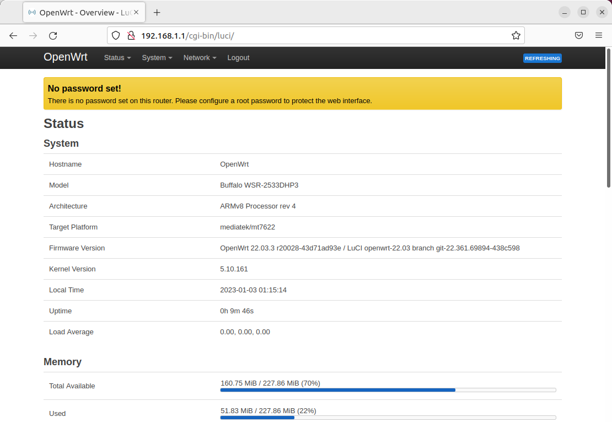
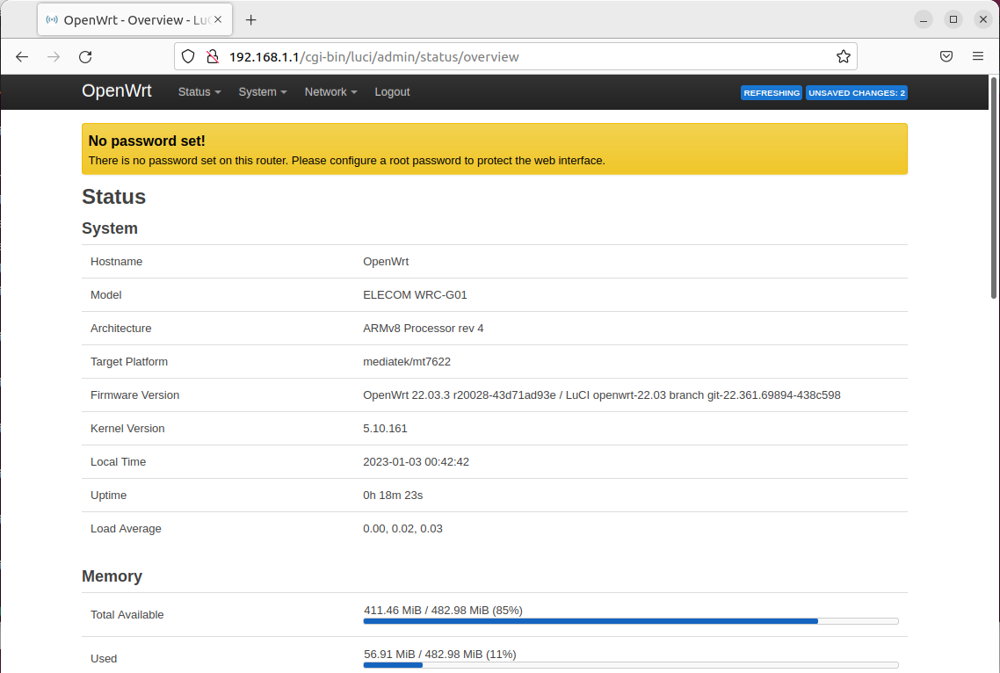

# OpenWrt 非公式ビルドファームウェア、パッチ

## 注意

* 広範囲なテストは行っていませんので各人の責任でお使いください  
* 法律上、無線機能を有効にすることはおすすめしません
* OpenWrtで各機種が正式にサポートされると消えます...

## 機種リスト

* 22.03.3 (リリースビルドの同バージョンに対応)
   - [Buffalo WSR-3200AX4S](#buffalo-wsr-3200ax4s)
   - [Buffalo WSR-2533DHP3/WSR-A2533DHP3](#buffalo-wsr-2533dhp3--wsr-a2533dhp3)
   - [ELECOM WRC-X3200GST3](#elecom-wrc-x3200gst3) (snapshotではサポート済)
   - [ELECOM WRC-G01](#elecom-wrc-g01)

 
 

## Buffalo WSR-3200AX4S

### パッチ  
&nbsp;&nbsp; [patch/mt7622-buffalo_elecom_22.03.3.patch](./patch/mt7622-buffalo_elecom_22.03.3.patch)  
  
&nbsp;&nbsp;&nbsp; ※ このパッチは以下などを参考にしました    
&nbsp;&nbsp;&nbsp;&nbsp;&nbsp; https://github.com/musashino-build/openwrt/tree/devadd/wsr-3200ax4s

### ビルド済みファームウェア
&nbsp;&nbsp;&nbsp; [bin/(version)/](./bin/openwrt_22.03.3-5.10.161-1-d78c2c2d176f211691088dca5d5407af) からインストール方法により選択します  

### インストール方法
* その1
   * 純正ファームウェアのアップデート画面から _openwrt-mediatek-mt7622-buffalo_wsr-3200ax4s-squashfs-**factory**.bin_ を投入
   
* その2
   * AOSSボタンでTFTPブートしその後sysupgradeでインストール
      - PC(など)でTFTPサーバー(192.168.11.2/24)を立ち上げ _openwrt-mediatek-mt7622-buffalo_wsr-3200ax4s-**initramfs-kernel**.bin_ を `/linux.trx-recovery` と
して置く
      - AOSSボタンを押しながら WSR-3200AX4S の電源を入れる(TFTPダウンロード後、最小構成のOpenWrtが起動)
      - PCを `192.168.1.x/24`(192.168.1.1以外) に変更してから、scpなどを使用して `root@192.168.1.1:/tmp` に _openwrt-mediatek-mt7622-buffalo_wsr-3200ax4s-squashfs-**sysupgrade**.bin_ を転送
      - ssh で `root@192.168.1.1` に接続
      - sysupgrade で `/tmp/openwrt-mediatek-mt7622-buffalo_wsr-3200ax4s-squashfs-sysupgrade.bin` を投入
 
 

## Buffalo WSR-2533DHP3 / WSR-A2533DHP3

### パッチ  
&nbsp;&nbsp; (WSR-3200AX4S のパッチに含まれています)

### ビルド済みファームウェア

&nbsp;&nbsp; (WSR-3200AX4S と同様です)

### インストール方法

&nbsp;&nbsp; (WSR-3200AX4S の手順と同様。ファイル名は適宜読み替えてください)

### インストール直後のステータス画面

 
 

## ELECOM WRC-X3200GST3

### パッチ  
&nbsp;&nbsp; (WSR-3200AX4S のパッチに含まれています)

### ビルド済みファームウェア

&nbsp;&nbsp; (WSR-3200AX4S と同様です)

### インストール方法

* 純正ファームウェアのアップデート画面から _openwrt-mediatek-mt7622-elecom_wrc-x3200gst3-squashfs-**factory**.bin_ を投入

 
 

## ELECOM WRC-G01

### パッチ  
&nbsp;&nbsp; (WSR-3200AX4S のパッチに含まれています)

### ビルド済みファームウェア

&nbsp;&nbsp; (WSR-3200AX4S と同様です)

### インストール方法

* 純正ファームウェアのアップデート画面から _openwrt-mediatek-mt7622-elecom_wrc-g01-squashfs-**factory**.bin_ を投入
 

### インストール直後のステータス画面

 
 
